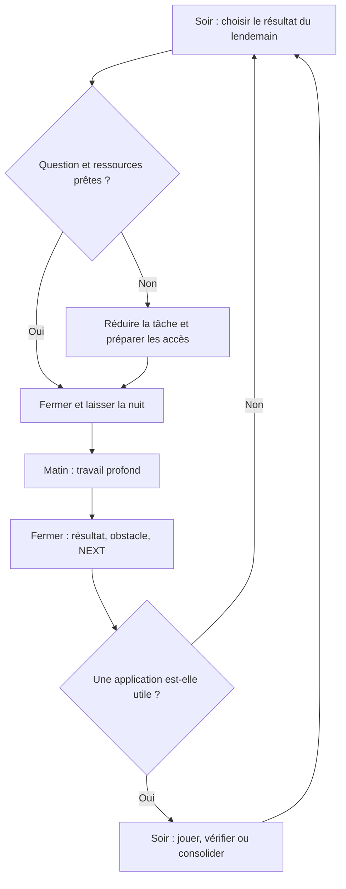
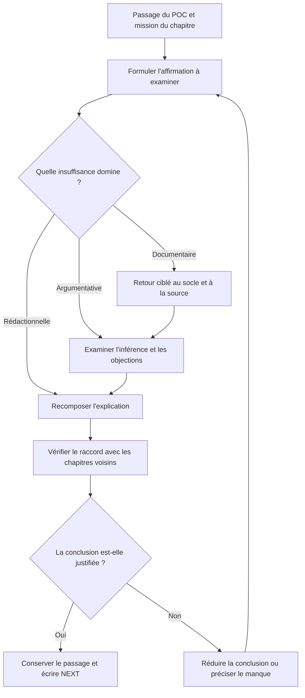
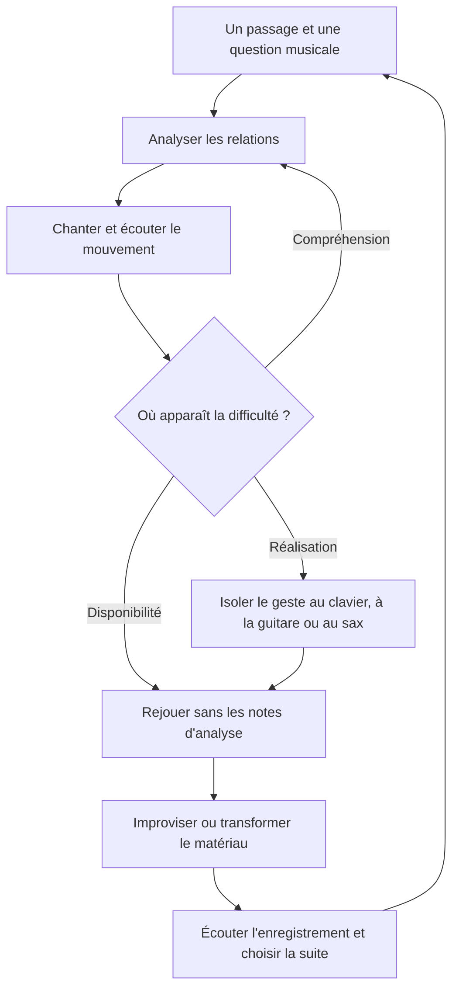
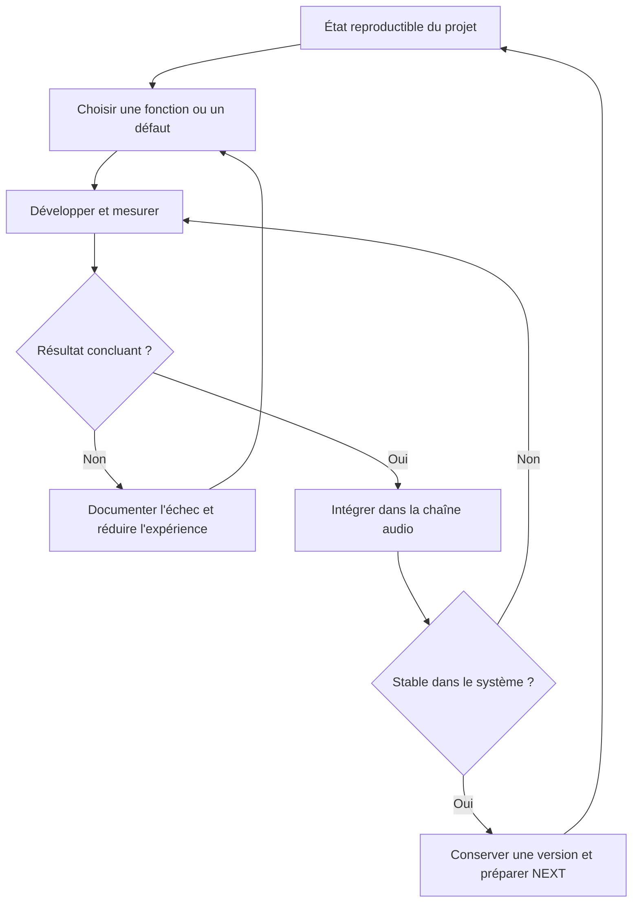

****  
**Essai politique · Musique · RustFX**  
_Document directeur — septembre 2026 à septembre 2027 — Version 1.0_

> Maintenir trois projets exigeants dans la durée, en donnant périodiquement à chacun assez de profondeur pour franchir un véritable changement de niveau.

**1. La fonction de ce document**

Ce document organise les décisions qui produiront tes semaines : quel projet approfondir, comment préparer une séance, ce qui constitue un progrès et quand modifier la répartition du travail.

Il repose sur trois échelles complémentaires :

|Échelle|Question|Résultat attendu|
|---|---|---|
|Année|Quelles capacités et quels objets veux-je construire ?|Jalons à 3, 6 et 12 mois|
|Semaine|Où concentrer mon énergie maintenant ?|Un résultat prioritaire par projet actif|
|Séance|Quelle transformation précise puis-je accomplir ?|Une trace exploitable et une prochaine action|

Les échéances sont des **cibles de pilotage**. Leur réalisme sera réévalué à partir des premières semaines effectivement travaillées. Un jalon se franchit lorsque ses critères sont remplis ; sa date ne suffit pas à le valider.

La référence initiale est septembre 2026. Si le démarrage effectif se décale, déplacer les horizons ensemble.

**2. Trois projets, trois formes de progrès**

Les projets partagent une méthode de continuité, mais leurs résultats ne sont pas interchangeables.

|Projet|Transformation recherchée|Preuve de progression|
|---|---|---|
|Essai|Matière → compréhension → argument → texte|Un passage mieux démontré, reformulé et raccordé|
|Musique|Compréhension → oreille → jeu → réutilisation|Une idée entendue, jouée et réemployée|
|RustFX|Expérimentation → fonction → intégration → système|Un comportement reproductible dans la chaîne audio|

Une lecture ciblée peut constituer une excellente séance d’essai sans produire immédiatement une page. Elle doit cependant laisser une compréhension formulée, une décision ou une question mieux délimitée.

Une séance musicale peut produire peu de connaissances nouvelles et beaucoup de progrès si un mouvement harmonique devient disponible à l’oreille et sous les doigts.

Une séance RustFX peut supprimer du code et faire avancer le projet si elle élimine une voie fragile ou stabilise une interface.

**L’unité de progrès est la transformation obtenue.**

**3. Choisir le régime de chaque projet**

L’équilibre se juge sur plusieurs semaines. Une semaine consacrée davantage à l’essai peut être cohérente, à condition de connaître son objectif et de préparer la continuité des autres activités.

|Régime|Fonction|Engagement concret|Sortie du régime|
|---|---|---|---|
|Sprint|Produire un résultat délimité|Davantage de séances pendant une durée annoncée|Résultat obtenu ou bilan à la date prévue|
|Actif|Faire avancer le projet régulièrement|Séances profondes et résultat hebdomadaire|Révision au bilan|
|Maintenance|Préserver l’état et réduire le coût de reprise|Contact court, contexte à jour, NEXT exploitable|Retour à l’activité ou pause assumée|
|Pause volontaire|Libérer de la capacité|État sauvegardé et date de réexamen|Décision explicite de reprise|
|Loisir libre|Jouer, explorer, se détendre|Aucune obligation de résultat|Au choix|

La **continuité** désigne la facilité avec laquelle tu peux reprendre. Elle peut être préservée pendant une semaine de maintenance et perdue pendant une semaine pourtant chargée si aucune séance ne laisse de trace.

Le MPC/FM1 et la production restent principalement dans le loisir libre. Ils rejoignent ponctuellement le travail musical lorsqu’une idée appelle un arrangement, une boucle ou une maquette.

**4. La journée : préparer, approfondir, fermer**

Le rythme visé est un réveil vers 6 h, puis un bloc personnel autour de 6 h 30–8 h lorsque la journée le permet.

L’adoption doit rester progressive. Commencer par quelques matinées préparées, observer la fatigue et la qualité du travail, puis étendre. Le coucher et les contraintes professionnelles doivent rendre ce rythme praticable.

**Le soir réduit les décisions nécessaires au démarrage du lendemain.**

Il existe deux formats de soirée :

|Format|Durée indicative|Fonction|
|---|--:|---|
|Préparation minimale|10–20 min|Choisir la question, ouvrir les ressources, écrire le départ|
|Séance complémentaire|45–90 min, parfois davantage|Application instrumentale, lecture ciblée ou consolidation|

La possibilité de travailler une à deux heures en soirée reste une marge disponible. Elle ne devient pas une dette quotidienne.

Une séance de 90 minutes peut suivre ce découpage souple :

|Moment|Durée indicative|Action|
|---|--:|---|
|Reprise|5 min|Lire NEXT et retrouver le résultat visé|
|Travail central|70 min|Traiter une seule question principale|
|Fermeture|15 min|Conserver le résultat et préparer la reprise|

Si une lecture ou un débogage prend toute la séance, la fermeture reste nécessaire. Elle transforme un effort interrompu en travail reprenable.

**5. Le mécanisme NEXT**

Chaque séance importante se termine par cinq lignes au maximum :

> **ÉTAT :** où en est l’objet travaillé ?  
> **RÉSULTAT :** qu’ai-je compris, produit ou éliminé ?  
> **OBSTACLE :** quelle difficulté reste ouverte ?  
> **NEXT :** quelle action exacte déclenche la prochaine séance ?  
> **ACCÈS :** quel fichier, passage, morceau ou test faut-il ouvrir ?

Un bon NEXT contient **un verbe, un objet et un critère d’arrêt**.

|Projet|Exemple|
|---|---|
|Essai|« Reprendre le passage sur l’après-indépendance ; confronter l’affirmation de continuité au passage repéré chez Leveau ; terminer par une formulation distinguant fait et inférence. »|
|Musique|« Reprendre huit mesures du standard choisi ; chanter le mouvement des notes guides, puis le réaliser au clavier et à la guitare ; enregistrer un essai. »|
|RustFX|« Reproduire le défaut avec le signal de test enregistré ; comparer traitement actif et contourné ; consigner la mesure avant de modifier le bloc. »|

« Continuer le chapitre » et « travailler l’harmonie » ne donnent pas assez d’information pour redémarrer.

**6. Une géométrie de semaine soutenable**

Les points d’ancrage sont :

- trois matinées possibles pour l’essai ;
    
- deux matinées pour l’harmonie ;
    
- RustFX le lundi à partir d’environ 16 h et le samedi matin ;
    
- un court entretien RustFX ;
    
- des applications instrumentales en soirée ;
    
- au moins une soirée entièrement libre.
    

Ces engagements doivent tenir dans une semaine réelle. Voici une **configuration de départ**, à déplacer selon les jours de présence et de télétravail.

|Jour|Travail principal|Complément possible|
|---|---|---|
|Lundi|RustFX long à partir de 16 h|Matin disponible ; soirée légère|
|Mardi|Essai, 6 h 30–8 h|Instrument et préparation de mercredi|
|Mercredi|Harmonie, 6 h 30–8 h|Application instrumentale puis préparation de jeudi|
|Jeudi|Essai, 6 h 30–8 h|Maintenance RustFX courte ; préparation de vendredi|
|Vendredi|Harmonie, 6 h 30–8 h|Soirée libre|
|Samedi|RustFX long le matin|Après-midi libre ; préparation brève de dimanche|
|Dimanche|Essai, bloc matinal adaptable|Bilan hebdomadaire et préparation de la semaine|

Le lundi matin reste disponible parce que la longue séance RustFX porte déjà la charge principale de la journée. Le troisième bloc d’essai trouve ici sa place le dimanche. Si ce choix pèse trop sur le week-end, passer à deux matinées d’essai et ajuster la trajectoire.

**La séance du samedi se prépare le jeudi ou à la fermeture du lundi**, afin que la soirée libre du vendredi reste réellement libre.

Avec des séances RustFX de deux à trois heures, cette configuration représente environ **11 h 30 à 13 h 30 de travail principal**, avant maintenance, préparation et instruments. L’enveloppe totale peut donc rapidement dépasser quinze heures. Elle mérite un essai de deux semaines avant d’être considérée comme une routine acquise.

**7. Essai politique : deux objets, deux méthodes**

L’essai possède déjà une architecture, des drafts, des socles et un modèle final développé. Ces matériaux constituent le point de départ. Leur existence ne préjuge pas de la solidité de chaque passage.

La trajectoire distingue nettement :

|Objet|Question centrale|Travail dominant|
|---|---|---|
|POC 0.1|Quel essai existe déjà avec les matériaux disponibles ?|Assembler et rendre la démonstration continue|
|Passes approfondies|Chaque élément remplit-il réellement sa fonction ?|Lire, vérifier, raisonner et réécrire|
|Draft 1|La démonstration complète tient-elle ?|Consolider tous les chapitres et leurs relations|
|Draft 2|Le manuscrit porte-t-il clairement cette démonstration ?|Réviser l’architecture, les objections et l’écriture|

**Le POC : dix à quatorze jours**

Son matériau principal est constitué des drafts et du fil conducteur. Les socles interviennent lorsqu’un raccord exige un complément précis.

|Période indicative|Travail|Résultat|
|---|---|---|
|J1–J2|Identifier les versions directrices et l’ordre de lecture|Manuscrit maître et liste des pièces manquantes|
|J3–J9|Assembler les chapitres et écrire les raccords provisoires|Démonstration lisible de bout en bout|
|J10–J12|Relire l’ensemble selon le fil conducteur|Ruptures, répétitions et conclusions trop fortes repérées|
|J13–J14|Corriger les ruptures majeures et figer la version|POC 0.1 et priorités de reprise|

Ce sont des fenêtres calendaires : elles n’exigent pas quatorze journées de travail. Le nombre de séances nécessaire dépendra notamment du volume à assembler.

Le POC accepte les mentions `[source à reprendre]`, `[transition provisoire]` ou `[hypothèse]`. Il doit toutefois montrer ce que chaque partie apporte au raisonnement.

**Critère d’arrêt :** une lecture complète est possible et les principales faiblesses sont localisées. À ce stade, le POC devient l’objet du travail approfondi.

**8. Essai : travailler verticalement, élément par élément**

Le chapitre donne le cadre. **L’unité de séance est un problème argumentatif.**

Pour chaque passage, il faut établir :

- ce qu’il affirme ;
    
- sur quelle preuve il repose ;
    
- pourquoi cette preuve autorise cette conclusion ;
    
- ce qui limite cette conclusion ;
    
- ce que le passage transmet à la suite.
    

La distinction entre insuffisances évite de répondre à tout par davantage de lecture.

|Insuffisance|Diagnostic|Action adaptée|
|---|---|---|
|Documentaire|Un fait ou une interprétation manque d’appui|Revenir à une source précise|
|Argumentative|Les éléments présents ne suffisent pas à établir la conclusion|Revoir le raisonnement, comparer, limiter|
|Rédactionnelle|La démonstration est disponible mais mal exposée|Réordonner et reformuler|

L’ordre des passes suit les **dépendances de la démonstration**. Après le POC, un raccord défaillant peut devenir prioritaire sur un chapitre plus faible mais moins déterminant.

Pour C13, chaque résultat mobilisé doit pouvoir être relié à une démonstration antérieure. Si cette relation manque, décider s’il faut renforcer le chapitre d’origine, limiter le modèle ou retirer l’usage concerné.

La rédaction s’apprend à l’intérieur de ce travail : expliquer d’abord le raisonnement avec tes mots, vérifier ensuite les nuances dans les matériaux, puis retravailler la forme. La comparaison avec le draft devient un instrument d’apprentissage.

**9. Jalons de l’essai**

|Horizon|Niveau visé|Critères de passage|
|---|---|---|
|Fin septembre 2026 environ|**POC 0.1**|Manuscrit continu ; mission des parties visible ; lacunes signalées|
|Décembre 2026|**Passe profonde engagée et méthode stabilisée**|Plusieurs chapitres réellement retravaillés ; problèmes majeurs classés ; exemples de preuves et d’inférences corrigées|
|Mars 2027|**Draft 1 sérieux**|Tous les chapitres ont reçu une passe importante ; principales sources revérifiées ; transitions reconstruites ; modèle final alimenté par la démonstration|
|Septembre 2027|**Draft 2 mature**|Architecture et style révisés ; répétitions réduites ; contre-arguments traités ; affirmations importantes vérifiées ; retour extérieur intégré s’il est disponible|

Après quelques passes, estimer le rythme réel. Si un chapitre exige beaucoup plus de séances que prévu, modifier le périmètre ou la date. **La vérification argumentative reste un critère de qualité.**

**10. Musique : faire circuler un même matériau**

Le projet musical relie harmonie, oreille, guitare, clavier, saxophone, improvisation et création.

BJH constitue un socle disponible. Le travail annuel consiste à rendre ce savoir utilisable, puis à construire les passerelles qui dépassent ce socle.

Pour éviter sept programmes concurrents, organiser le travail autour de **petits dossiers musicaux** : un morceau ou un passage, une question principale et une réutilisation.

|Dimension|Travail sur le même matériau|
|---|---|
|Analyse|Expliquer les fonctions, les mouvements et la relation mélodie–harmonie|
|Oreille|Chanter, reconnaître ou relever une partie du mouvement|
|Clavier|Rendre la structure et les voix audibles|
|Guitare|Construire des voicings, un accompagnement ou une ligne|
|Saxophone|Travailler une ligne, l’articulation, le rythme et le phrasé|
|Improvisation|Développer une idée en suivant les mouvements étudiés|
|Création|Réutiliser un procédé dans quelques mesures ou une maquette|

Chaque séance sélectionne une partie de ce parcours. Le transfert entre instruments peut s’étendre sur plusieurs jours.

**La boucle musicale**

Le soir prépare le passage et la question. Le matin approfondit la compréhension. Une séance pratique ultérieure vérifie ce que cette compréhension change à l’écoute et au jeu.

La pratique instrumentale conserve également ses besoins propres : son, précision, articulation, coordination et rythme. Une explication harmonique ne remplace pas ce travail.

Au saxophone, prendre en compte la transposition lorsque le même matériau circule depuis le clavier ou la guitare.

**Russell et le post-BJH**

Introduire un concept lorsqu’une question musicale lui donne une fonction identifiable :

> Qu’est-ce que cette perspective permet d’entendre, d’expliquer ou de produire dans le matériau travaillé ?

Le concept est suffisamment exploité lorsqu’il peut être expliqué, illustré et comparé à la lecture précédente. Le nombre de vidéos terminées reste secondaire.

**11. Jalons de la musique**

Les volumes ci-dessous sont des repères initiaux à ajuster après observation du jeu actuel.

|Horizon|Niveau visé|Manifestation concrète|
|---|---|---|
|Décembre 2026|**Langage harmonique disponible**|Deux ou trois morceaux laboratoires ; analyses moins dépendantes des notes ; réalisations au clavier et à la guitare ; sax entretenu ; premières traces audio comparables|
|Mars 2027|**Passerelles construites**|Sur quelques passages : chanter un mouvement, le réaliser sur plusieurs instruments, improviser une ligne et en tirer une variation ; premières transcriptions courtes ; quelques concepts post-BJH utiles|
|Septembre 2027|**Première autonomie musicale intégrée**|Préparer un morceau avec une méthode autonome ; relier analyse, écoute, accompagnement et improvisation ; produire quelques arrangements ou créations courts|

**Le jalon de six mois prépare directement celui d’un an :**

|Travail engagé avant mars|Capacité attendue vers septembre|
|---|---|
|Chant des mouvements et transcriptions courtes|Entendre davantage de relations avant de les jouer|
|Notes guides, motifs et phrasé|Improviser avec une direction musicale|
|Transfert d’un même passage entre instruments|Adapter une idée à plusieurs moyens d’expression|
|Variations et mini-arrangements|Construire une petite production cohérente|
|Concepts post-BJH sélectionnés|Comparer des lectures et choisir un procédé consciemment|

L’autonomie annuelle reste un premier niveau : elle n’implique ni une maîtrise égale des trois instruments ni la capacité de traiter immédiatement tout standard.

**12. RustFX : faire converger développement et intégration**

RustFX doit redevenir un système que tu peux ouvrir et faire progresser directement.

La première étape établit l’état réel du projet : ce qui fonctionne déjà, ce qui fonctionne seulement isolément, ce qui reste supposé et ce qui bloque l’usage.

La roadmap active tient en trois positions :

|Position|Contenu|
|---|---|
|Maintenant|Un obstacle ou une fonction à traiter|
|Ensuite|L’intégration nécessaire pour rendre ce travail utile|
|Plus tard|Les extensions conservées hors du travail courant|

La chaîne de référence est : **entrée audio → traitement → sortie**, avec un contrôle exploitable des paramètres.

**Deux séances longues complémentaires**

|Séance|Orientation par défaut|Résultat attendu|
|---|---|---|
|Lundi à partir de 16 h|Exploration et développement|Hypothèse testée, défaut compris ou bloc développé|
|Samedi matin|Intégration et consolidation|Travail replacé dans la chaîne, comportement mesuré, état reproductible|
|Entretien en semaine|Préparation et continuité|État connu, ressources prêtes, prochaine expérience définie|

Cette répartition reste adaptable. Elle sert surtout à empêcher l’accumulation de blocs isolés.

Les mesures répondent à une question concrète : latence, charge de calcul, saturation, stabilité, artefacts ou comportement des paramètres. Les valeurs acceptables sont à définir selon l’architecture retenue et l’usage guitare.

L’intégration de blocs avancés comme NAM/A2 Light reste conditionnée aux ressources réellement disponibles et aux résultats du socle audio.

**13. Jalons RustFX**

|Horizon|Niveau visé|Critères de passage|
|---|---|---|
|Décembre 2026|**Projet vivant et socle fonctionnel**|Environnement reproductible ; architecture comprise ; chaîne audio/DSP significative ; problème suivant clairement identifié|
|Mars 2027|**Prototype jouable**|Une guitare traverse le système ; effets principaux utilisables ; paramètres contrôlables ; stabilité et performances observées|
|Septembre 2027|**Plateforme personnelle extensible**|Ajout ou remplacement d’un effet sans reconstruction générale ; interfaces et contrôle cohérents ; intégration matérielle suffisamment stable|

À trois mois, le test principal est la reprise : **peux-tu commencer à travailler sur le multi-effet dès l’ouverture de la séance ?**

À six mois, le test principal est l’usage : **peux-tu jouer avec un système cohérent ?**

À un an, le test principal est l’évolution : **peux-tu modifier une partie tout en conservant le fonctionnement de l’ensemble ?**

**14. Gérer la charge et la présence mentale**

Une journée possède généralement un seul front personnel lourd. Le travail professionnel peut déjà avoir consommé une grande partie de la capacité disponible.

|Énergie disponible|Choix adapté|
|---|---|
|Bonne|Lecture difficile, raisonnement, analyse harmonique ou débogage exigeant|
|Moyenne|Réécriture délimitée, pratique connue, intégration préparée|
|Faible|NEXT, classement ciblé, écoute libre, fermeture ou repos|

Il faut distinguer cinq phénomènes :

|Phénomène|Comment le reconnaître|
|---|---|
|Temps investi|Durée effectivement consacrée à l’activité|
|Présence mentale|Place occupée par le projet, y compris hors séance|
|Apprentissage|Compréhension formulable ou capacité réutilisable|
|Production|Objet transformé : texte, enregistrement, fonction intégrée|
|Rumination|Même problème revisité sans apport ni décision nouvelle|

Une idée utile hors séance peut être capturée en une ligne. Si elle provoque sans cesse la réouverture du projet, la question devient celle de la charge mentale.

**Règles en cas de surcharge**

|Signal|Décision|
|---|---|
|Deux séances consécutives peinent à démarrer|Réduire la prochaine tâche et améliorer NEXT|
|Plusieurs soirées deviennent obligatoires|Supprimer une séance complémentaire ou réduire le régime d’un projet|
|Un projet monopolise l’attention sans résultat nouveau|Définir une question fermée et un critère d’arrêt|
|Un projet devient difficile à reprendre|Prévoir une séance de remise en contexte délimitée|
|Fatigue persistante ou sommeil écourté|Alléger le volume et revoir les horaires|
|Semaine perturbée|Choisir une priorité et préserver seulement les reprises utiles|

Une séance manquée ne doit pas être automatiquement ajoutée au week-end. Au bilan, décider si sa tâche reste prioritaire.

**15. Suivre sans construire une bureaucratie**

Une trace de fermeture par séance et une ligne par projet au bilan suffisent.

|Indicateur|Observation légère|Utilité|
|---|---|---|
|Temps et séances profondes|Durée approximative et nombre de blocs|Vérifier la capacité réellement disponible|
|Production|Une ou deux traces|Constater la transformation|
|Continuité|Date du dernier contact utile|Repérer l’abandon progressif|
|Coût de reprise|Immédiat, quelques minutes, reprise longue|Améliorer les fermetures|
|Présence mentale|Faible, proportionnée, envahissante|Détecter le déséquilibre|
|Momentum|Facile à relancer, stable, bloqué|Choisir le régime suivant|
|Rendement|Élevé, normal, décroissant, faible|Adapter la méthode|

Ces catégories n’ont pas vocation à produire une note globale. Elles doivent aider à prendre une décision.

**Tableau de bord à réutiliser**

|Projet|Régime|Résultat de la semaine|Blocage principal|Reprise|NEXT|
|---|---|---|---|---|---|
|Essai|…|…|…|…|…|
|Musique|…|…|…|…|…|
|RustFX|…|…|…|…|…|

**16. Le bilan hebdomadaire**

Prévoir environ vingt minutes le dimanche, avant de répartir les séances.

**Observer.** Pour chaque projet, relever ce qui a été produit, compris et laissé ouvert. Regarder les traces plutôt que reconstituer toutes les heures.

**Décider.** Choisir le régime de la semaine suivante et un résultat principal pour chaque projet actif.

**Placer.** Installer les séances lourdes, les préparations indispensables et la soirée libre. Laisser de la marge.

**Préparer.** Écrire le point de départ du premier bloc.

La fiche hebdomadaire tient dans ce cadre :

> **Contraintes et énergie prévues :** …  
> **Priorité de la semaine :** …  
> **Essai — régime, résultat et première action :** …  
> **Musique — régime, résultat et première action :** …  
> **RustFX — régime, résultat et première action :** …  
> **Soirée libre et marge conservée :** …  
> **Un ajustement de méthode à essayer :** …

**17. La revue mensuelle et la trajectoire annuelle**

La revue mensuelle prend davantage de recul, sans reprendre toutes les notes.

Examiner :

1. Quel projet a reçu le plus de temps et lequel a occupé le plus d’attention ?
    
2. Quelles transformations sont désormais visibles ?
    
3. Quel projet coûte davantage à reprendre ?
    
4. Les critères du prochain jalon se rapprochent-ils ?
    
5. Quelle méthode produit peu malgré plusieurs essais ?
    
6. Quel unique changement de répartition tester le mois suivant ?
    

Conserver les décisions qui fonctionnent assez longtemps pour observer leur effet. Changer tous les horaires chaque semaine rend le diagnostic difficile.

|Période|Essai|Musique|RustFX|
|---|---|---|---|
|Septembre 2026|Assemblage du POC|Choix du matériau commun et premières traces|État des lieux reproductible|
|Octobre–décembre|Passes sur les problèmes prioritaires|Consolidation du langage et applications|Socle audio/DSP et reprise fluide|
|Janvier–mars 2027|Achèvement visé des passes du Draft 1|Oreille, transfert, improvisation et création courte|Prototype jouable|
|Avril–juin|Révision globale et objections|Intégration sur un répertoire choisi|Stabilisation et extensibilité|
|Juillet–septembre|Draft 2 et éventuel retour extérieur|Arrangements, créations et autonomie accrue|Plateforme personnelle|

**Démarrage proposé :** deux semaines de sprint POC, avec musique en continuité et RustFX au niveau compatible avec l’assemblage. À la fin de cette fenêtre, figer le POC, examiner la charge réellement supportée et revenir à la géométrie normale. Toute séance empruntée à un autre projet doit avoir une date de restitution.

---

**MON SYSTÈME DE TRAVAIL EN UNE PAGE**

**Matin / soir**

Le soir prépare une question, les ressources et le point de départ. Le matin porte le travail profond. Chaque séance se ferme par un résultat, un obstacle éventuel et **NEXT**. Une préparation courte suffit ; les longues soirées restent optionnelles.

**Structure hebdomadaire**

|Essai|Musique|RustFX|Espace libre|
|---|---|---|---|
|Trois matinées possibles|Deux matinées d’harmonie et applications instrumentales|Lundi dès 16 h, samedi matin, entretien court|Une soirée entièrement libre et de la marge|

Le lundi matin reste disponible. Les jours peuvent changer selon les contraintes. Le troisième bloc d’essai est ajustable.

**Les trois parcours**

|Essai|Musique|RustFX|
|---|---|---|
|Comprendre → argumenter → écrire|Comprendre → entendre → jouer → créer|Expérimenter → développer → intégrer|

**Les jalons**

|Horizon|Essai|Musique|RustFX|
|---|---|---|---|
|**3 mois**|POC et plusieurs passes profondes|Langage harmonique utilisable|Socle audio/DSP fonctionnel|
|**6 mois**|Draft 1 sérieux|Passerelles entre oreille, instruments, improvisation et création|Prototype jouable|
|**12 mois**|Draft 2 mature|Première autonomie musicale intégrée|Plateforme extensible|

**Les règles fondamentales**

- Un front personnel lourd par jour, en tenant compte de la journée professionnelle.
    
- Une question principale par séance et un NEXT précis à la fermeture.
    
- Un sprint possède un résultat et une date de fin.
    
- Les lectures répondent à un besoin ; les expériences rejoignent le système.
    
- Le MPC/FM1 conserve une place libre.
    
- Les jalons se valident par leurs résultats.
    
- Les séances manquées sont réévaluées au bilan.
    

**Les signaux qui demandent un ajustement**

Reprise longue répétée ; fatigue persistante ; soirées devenues obligatoires ; projet mentalement envahissant ; accumulation de lectures ou d’expériences sans transformation ; disparition prolongée d’un projet ; critères de jalon qui cessent de se rapprocher.