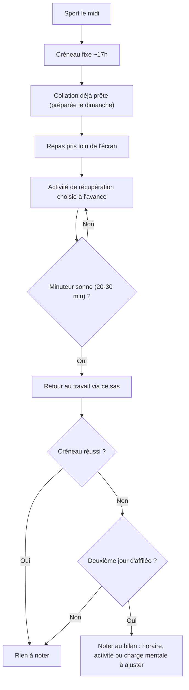
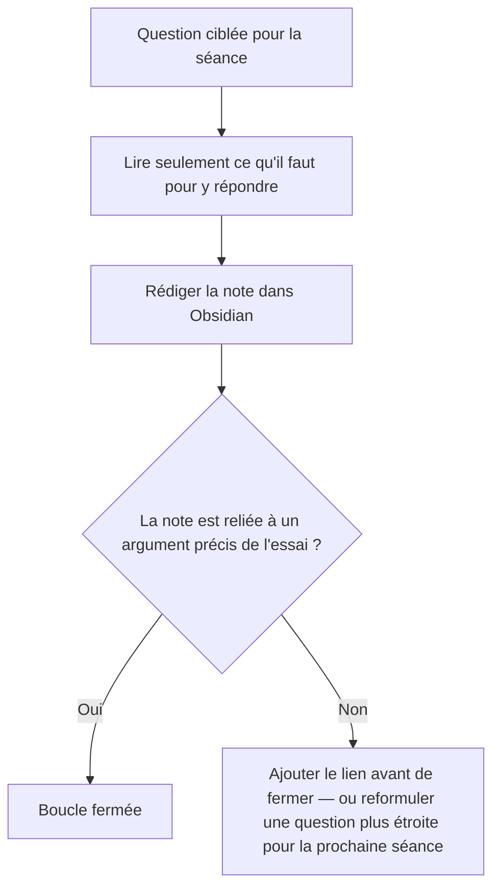

# MON SYSTÈME DE TRAVAIL — Complément 1
## Gestion de l'énergie et méthode de rédaction de l'essai
Addendum au document directeur (septembre 2026 – septembre 2027, version 1.0) — septembre 2026

**Statut.** Ce document ne remplace pas le document directeur, il le complète. Il naît d'un constat fait après une première mise à l'épreuve : le programme est réaliste à environ 80 %, ce qui en fait un bon programme — à condition de nommer ce qui manque plutôt que de l'ignorer. Trois manques ont été identifiés : le temps libre visible (lecture hors-sujet, matchs), la gestion de la fatigue mentale, et la gestion de la fatigue physique. Ce complément y répond, et précise au passage ce que « fermer une boucle » veut dire concrètement pour l'essai.

⸻

## 1. La fenêtre de fin d'après-midi

### 1.1 Le diagnostic

La chaîne identifiée : sport le midi → creux d'énergie prévisible vers 17h → faim traitée seulement quand elle devient pressante → repas qui déclenche une fatigue post-prandiale → scroll comme geste par défaut, qui ne restaure rien et prolonge la fatigue au lieu de la clore → la marge de la soirée est mangée avant même d'y arriver.

Ce n'est pas un manque de volonté. C'est un créneau de la journée qui n'a aucune forme prévue, donc qui se remplit du geste le plus facile disponible au moment précis où il reste le moins d'énergie pour en choisir un autre.

### 1.2 Le principe

Le levier n'est pas de se forcer au moment critique, mais de retirer la décision de ce moment-là. Le document directeur applique déjà ce principe au soir (« le soir réduit les décisions nécessaires au démarrage du lendemain ») — il s'étend ici plus tôt dans la journée.

### 1.3 Le protocole par défaut

1. **La collation est décidée avant, pas au moment de la faim.** Prête et visible ; rien à choisir à 17h.
2. **Le repas se prend loin de l'écran.** Téléphone hors de portée pendant ce créneau.
3. **L'activité qui suit est choisie à l'avance, pas sur le moment.** Une seule option décidée le matin même : marche courte, lecture hors-sujet, un bout de match.
4. **Le créneau a une fin fixée par un minuteur, pas par une sensation.** 20 à 30 minutes, alarme posée à l'avance.
5. **La reprise du travail ne se fait jamais directement depuis le repas.** Toujours en passant par ce sas.
6. **Un jour où ça échoue n'est pas une faute, c'est une donnée.** La règle utile : ne pas rater deux fois de suite. Un jour isolé n'invalide rien ; deux jours d'affilée se note au bilan du dimanche.

Ce protocole traite les trois manques d'un seul geste : il nomme le temps libre, il protège la fatigue mentale en interdisant l'intrusion des projets sur ce créneau, et il intercepte le scroll en donnant au corps fatigué un script au lieu d'un vide.

### 1.4 Outil

Deux alarmes suffisent : une pour la collation, une pour la fin du créneau de récupération. Si le scroll reste difficile à interrompre malgré l'alarme, la limite de temps d'écran déjà intégrée au téléphone (ou le mode avion pendant ce créneau) fait le travail sans rien installer de plus. Le seul outil à réellement construire est le lot de collations préparé une fois par semaine.

### 1.5 Quoi manger

Le principe : associer une protéine ou un gras à un glucide plutôt que du sucre seul, pour ralentir l'absorption et éviter le pic-puis-chute qui aggrave la fatigue post-repas. Options simples : œufs durs + fruit, yaourt nature + noix, houmous + légumes.

Exemple de collation préparable à l'avance (une douzaine, se garde une semaine au frigo) : dates dénoyautées, flocons d'avoine, beurre de cacahuète ou d'amande, graines de chia ou de lin, une pincée de sel — mixés au robot, façonnés en boules, réfrigérés. Préparée le dimanche, elle ne demande plus aucune décision en semaine.

### 1.6 Test

Deux semaines avant de juger ou d'ajuster le protocole. Un point encore ouvert à observer plutôt qu'à trancher d'avance : est-ce vraiment 17h qui est le bon moment, ou le décalage entre le sport de midi et le repas du soir qui joue.

⸻

## 2. Fermer une boucle : la bonne échelle

« Fermer le sujet traité » peut vouloir dire deux choses très différentes — une seule est tenable tous les matins.

Si ça veut dire résoudre entièrement la question du chapitre, du socle RustFX ou de l'harmonie, ça échouera régulièrement : rien de tout ça ne se règle en une séance, et forcer la clôture à ce niveau pousse à bâcler ou à abandonner la règle au premier échec.

Si « fermer » porte sur la question précise posée ce matin-là — pas le projet, le fil du jour — ça devient tenable. Le projet reste ouvert des semaines ; la question posée ce matin a une réponse nette à la fin de la séance, même négative. Un échec documenté (RustFX : hypothèse infirmée) compte comme une clôture valable, au même titre qu'un flowchart du document directeur le traite déjà.

Concrètement, le rituel NEXT gagne une question supplémentaire au moment de fermer : *la question posée ce matin a-t-elle une réponse, même négative ?* Si oui, la boucle est fermée. Si non, ce n'est pas un échec à cacher — c'est un signal que la question était mal calibrée, trop large pour une séance, et le NEXT devient : la reformuler plus étroite, pas « continuer ». Un indicateur simple à suivre dans le temps (et à ajouter à Mon atelier) : « sujet du jour clos : oui/non » sur chaque fermeture de séance.

⸻

## 3. Essai — équilibre lecture / prise de notes

Lecture et prise de notes n'ont pas le même rythme. Les coller sur « une partie importante » force soit des notes bâclées pour fermer la boucle, soit une lecture réduite pour bien noter.

**La correction : l'unité qui se ferme n'est plus « la partie lue », c'est la note elle-même.** On lit exactement ce qu'il faut pour produire cette note, ni plus ni moins. Le NEXT donné en exemple pour l'essai dans le document directeur a d'ailleurs déjà cette taille (« confronter l'affirmation de continuité au passage repéré chez Leveau ; terminer par une formulation distinguant fait et inférence ») — la granularité était déjà la bonne, juste pas encore appliquée à la lecture elle-même.

**Critère de clôture d'une note :** elle a au moins un lien, dans Obsidian, vers l'argument ou la partie de l'essai qu'elle va servir. Une note sans lien a peu de chances d'être réutilisée à la rédaction — ce critère fait à la fois office de fin de boucle et de garde-fou qualité.

**Pour les parties longues ou denses**, où même ça reste trop gros pour une séance : dédoubler le type de séance plutôt que forcer lecture et notation ensemble. Une séance de repérage (lecture rapide, passages marqués sans les rédiger) se ferme sur « X passages repérés » ; une séance de notation dédiée transforme ces repérages en notes propres et reliées, et se ferme sur « Y notes produites ».

⸻

## 4. NotebookLM — triage avant lecture

**Rôle.** Cibler et descoper une source avant de la lire : ce qui y est traité, ce qui manque, l'importance relative de chaque partie. Pas produire les notes elles-mêmes — celles-ci restent manuelles dans Obsidian, reliées à l'argument en cours.

**Condition pour que le descoping serve vraiment l'essai et non le texte en général :** donner à NotebookLM le contexte de l'argument travaillé (la question ou l'affirmation en cours), pas seulement la source brute, via les instructions personnalisées du notebook ou une question directe. Sans ce contexte, le résultat est un résumé bien informé mais générique au texte, pas une carte de lecture scopée sur l'essai.

**Limite à garder en tête.** « Ce qui manque » n'est valable que par rapport aux sources chargées dans le notebook — pas par rapport à la littérature en général. Utile pour prioriser la lecture du corpus déjà rassemblé, pas pour repérer une lacune de recherche plus large.

**Usage privilégié.** Le soir, en préparation (10-15 min de requêtes ciblées peuvent remplacer une bonne partie d'une séance de repérage) ; et en repérage rapide le matin pour localiser un passage précis dans une longue source. *(L'outil est passé de NotebookLM à Gemini Notebook en juillet 2026 ; les deux noms circulent encore.)*

⸻

## 5. La séance du dimanche — synthèse et référencement au POC

Le bloc « Essai, dimanche, adaptable » de la géométrie hebdomadaire — jusqu'ici le plus vague du tableau — reçoit un contenu précis : une séance de rédaction sur machine à écrire (Olivetti Lettera 32), à partir des notes de la semaine, pour écrire deux à trois pages expliquant l'idée générale de la semaine.

**Référencement obligatoire**, en tête de page : quel passage précis du POC est concerné, et laquelle relation s'applique — confirme / étend / complique / contredit. Sans cette étiquette explicite, le lien avec le POC reste une intention plutôt qu'un test de convergence. C'est le même réflexe que celui déjà demandé pour C13 dans le document directeur (« chaque résultat mobilisé doit pouvoir être relié à une démonstration antérieure »), appliqué à l'échelle de la semaine plutôt qu'au chapitre.

**Fermeture de cette séance** (remplace le rituel NEXT habituel, propre à cette séance) :
1. Scanner le texte immédiatement, à la fin de la séance — pas plus tard dans la semaine. Un texte tapé à la machine est très favorable à la reconnaissance de caractères (espacement uniforme, aucune ambiguïté de graphie) ; la reconnaissance de texte intégrée au téléphone suffit, sans outil spécialisé.
2. Coller le texte reconnu dans une nouvelle note Obsidian, avec le passage POC visé et la relation choisie.
3. Conserver le scan original attaché à la note — la reconnaissance bute parfois sur la ponctuation même sur un texte propre, et l'original permet de vérifier un mot exact plus tard.

**Alternative occasionnelle :** retaper le texte à la main dans Obsidian plutôt que scanner. Plus long, mais retaper en relisant fait une première passe de révision légère, dans le même esprit que la comparaison brouillon/matériaux déjà utilisée pour l'essai. À réserver aux semaines où le temps le permet — l'OCR reste le défaut pour deux à trois pages chaque semaine.

⸻

## 6. Ce que ça change dans la géométrie hebdomadaire

| Élément | Avant | Après ce complément |
|---|---|---|
| Fin d'après-midi (tous les jours) | Non défini | Fenêtre de récupération protégée : collation prévue, activité choisie d'avance, minuteur |
| Dimanche, bloc essai | « Bloc matinal adaptable » | Rédaction de synthèse (2-3 p.) + référencement POC explicite |
| Séances de lecture essai | Clôture floue (« partie lue ») | Clôture sur la note (formée, reliée à un argument) |
| Séances longues/denses | — | Dédoublement possible en repérage / notation |
| Rituel NEXT (séances essai) | 5 lignes | + « sujet du jour clos : oui/non » |

⸻

## 7. Révision

Ce complément suit la même logique que le document directeur : les jalons se valident par leurs résultats, pas par leur seule date. Le protocole de fin d'après-midi (section 1) est explicitement à l'essai pour deux semaines avant d'être considéré comme acquis. Le reste se réévalue au même rythme que le programme principal — bilan hebdomadaire, revue mensuelle.
